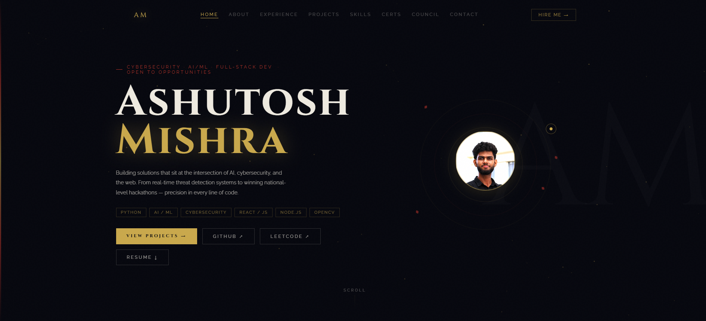

Ashutosh Mishra — Portfolio

Developer · Security · AI Engineer

🔗 View Live Site →

Personal portfolio site for a Cybersecurity & AI/ML enthusiast, IEEE Student Council VP, and SIH 2025 Grand Finalist. Built from scratch with vanilla JS and Three.js — no framework, no template.

🎬 Demo

✨ Highlights

Custom drag-to-unlock intro animation (sword-drag interaction) built with Three.js
Fully responsive, single-page design with smooth scroll navigation
Sections for experience, projects, skills, certifications, leadership, and contact
Flip-card certificate gallery and animated skill proficiency bars
Working contact form with public comment wall

🛠️ Built With

Three.js — intro animation / 3D interactions
Vanilla JavaScript — all interactivity, no frontend framework
CSS3 — animations, layout, responsive design
HTML5

📂 Project Structure

Portfolio/
├── index.html      # Main site markup
├── style.css       # All styling and animations
├── script.js        # Interactivity, scroll logic, Three.js intro
└── README.md

🚀 Running Locally

This is a static site with no build step.

bashgit clone https://github.com/ashutoshm0/Portfolio.git
cd Portfolio

Then just open index.html in your browser, or serve it locally:

bash# using Python
python -m http.server 5500

# or using VS Code Live Server extension

Visit http://localhost:5500 in your browser.

🖥️ Sections

SectionWhat it coversAboutBackground, GLBITM CSE '27, IEEE VP, GATE 2026ExperienceCisco Networking Academy, Brainwave Matrix, Unified Mentor internshipsProjectsAlertHer, StreamDecoder, NetShield, GripEaseSkillsLanguages, frameworks, cybersecurity toolkit, core CSCertificationsOracle, Palo Alto, Cisco, SIH 2025, and moreLeadershipIEEE Student Branch, Navrang Cultural Club, NSSContactDirect email, LinkedIn, resume, and a message form

🏆 Featured Projects

AlertHer — AI-powered women's safety system using YOLOv12 + MobileNetV4 for real-time CCTV threat detection with automated emergency dispatch.
GripEase — Adaptive, 3D-printed ergonomic pen for users with hand disabilities, using MPU6050 motion sensing. Selected for SIH 2025 Grand Finale.
NetShield — Network vulnerability simulator for cybersecurity training and pen-testing practice.
StreamDecoder — Real-time obfuscated/malicious code detection in live data streams.

📫 Contact

Email: pranshum830@gmail.com
LinkedIn: ashutoshmishra45
GitHub: ashutosh340
Resume: View / Download

⭐ If you found this portfolio interesting or it helped inspire your own, consider giving it a star.

<!--
GitHub Topics to add via repo Settings → "manage topics" (helps discoverability in GitHub search):
portfolio, personal-website, three-js, javascript, css3, github-pages, developer-portfolio
-->
